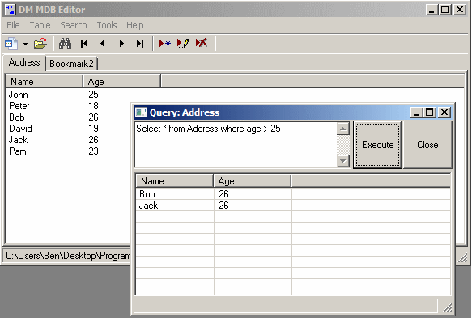



## DM MDB Editor/Viewer v1\.0

### Description

Hi this is a small tool I made to makeing Databases in VB with out a Access, you can add tables, fields, types, you can also add, edit and delete records this is only the first version so I hope you like it.
 
### More Info
 

             |
---                |---
**Submitted On**   |2009-03-11 15:35:42
**By**             |[dreamvb](https://github.com/Planet-Source-Code/PSCIndex/blob/master/ByAuthor/dreamvb.md)
**Level**          |Beginner
**User Rating**    |5.0 (40 globes from 8 users)
**Compatibility**  |VB 6\.0
**Category**       |[Databases/ Data Access/ DAO/ ADO](https://github.com/Planet-Source-Code/PSCIndex/blob/master/ByCategory/databases-data-access-dao-ado__1-6.md)
**World**          |[Visual Basic](https://github.com/Planet-Source-Code/PSCIndex/blob/master/ByWorld/visual-basic.md)
**Archive File**   |[DM\_MDB\_Edi2146783142009\.zip](https://github.com/Planet-Source-Code/dreamvb-dm-mdb-editor-viewer-v1-0__1-71867/archive/master.zip)

